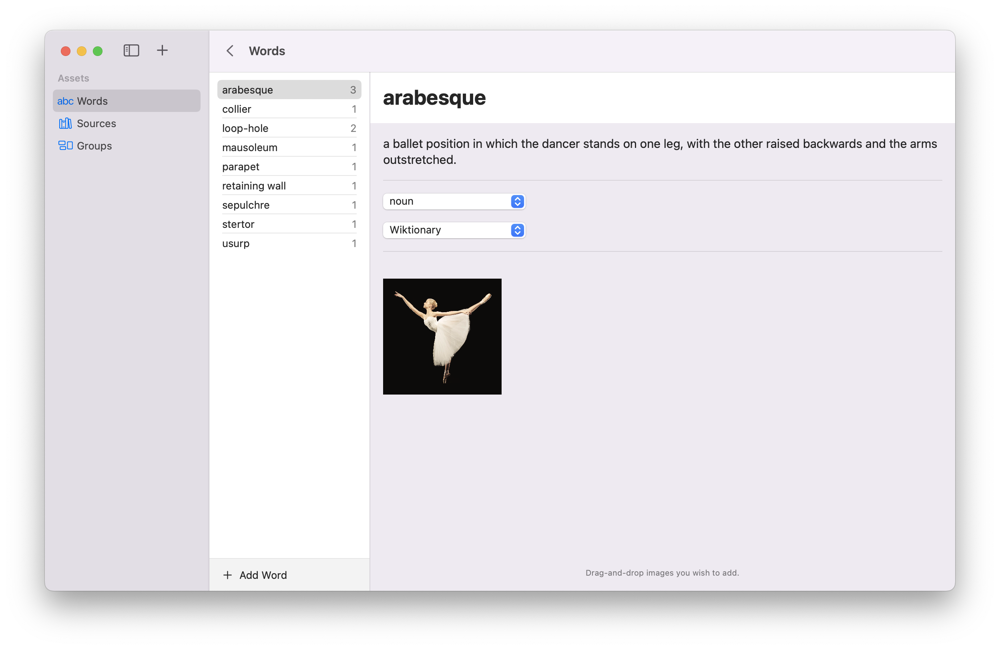

# Wordsmith

Wordsmith is a small SwiftUI/SwiftData app that allows you to store and group words and their definitions. It will ultimately be a multi-platform app, but currently only works properly on 
macOS (v 14.0 or later). Once I've got iOS support up and running, I intend to enhance its feature 
set to create an App Store compliant vocabulary builder.

